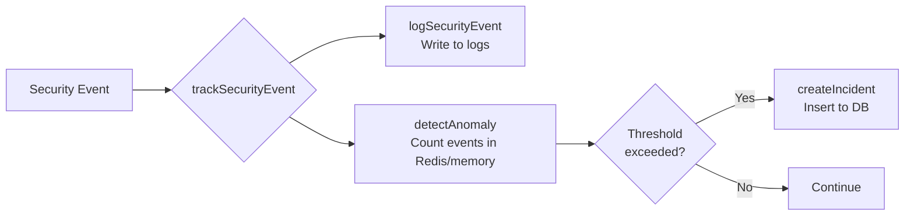

# Integrate `trackSecurityEvent` for Automated Incident Detection

## Overview

The `trackSecurityEvent` function in [logger.ts](file:///home/nishant/Desktop/trisikha/trisikha/lib/logger.ts#L71-97) was created to enable **automatic security incident creation** when suspicious events exceed configurable thresholds. Currently, all API routes use `logSecurityEvent` which only logs events but does **not** trigger the anomaly detection system in [incident.ts](file:///home/nishant/Desktop/trisikha/trisikha/lib/incident.ts#L284-359).

### How It Works



### Currently Tracked Events (from `incident.ts`)

| Event Type | Threshold | Window | On Threshold Hit |
|------------|-----------|--------|------------------|
| `rate_limit_exceeded` | 5 events | 10 min | Creates `rate_limit_exceeded` incident |
| `payment_signature_invalid` | 3 events | 10 min | Creates `payment_signature_invalid` incident (critical) |
| `webhook_signature_invalid` | 3 events | 10 min | Creates `webhook_signature_invalid` incident (critical) |
| `invalid_webhook_signature` | 3 events | 10 min | Same as above |
| `invalid_shiprocket_webhook_token` | 3 events | 10 min | Same as above |
| `otp_brute_force` | 10 events | 10 min | Creates `otp_brute_force` incident (high) |
| `otp_verification_failed` | 10 events | 10 min | Same as above |
| `unauthorized_access` | 5 events | 10 min | Creates `unauthorized_access` incident |

---

## Proposed Changes

> [!IMPORTANT]
> All changes require:
> 1. Changing import: `logSecurityEvent` → `trackSecurityEvent`
> 2. Adding `await` since `trackSecurityEvent` is async
> 3. Ensuring details include `ip`, `endpoint`, `orderId`, `userId` for accurate tracking

---

### Checkout & Payment

#### [MODIFY] [route.ts](file:///home/nishant/Desktop/trisikha/trisikha/app/api/checkout/route.ts)

**Line 9**: Update import
```diff
-import { logOrder, logPayment, logSecurityEvent, logError } from "@/lib/logger";
+import { logOrder, logPayment, trackSecurityEvent, logError } from "@/lib/logger";
```

**Line 31-35**: Update `rate_limit_exceeded` call
```diff
-      logSecurityEvent("rate_limit_exceeded", {
+      await trackSecurityEvent("rate_limit_exceeded", {
         endpoint: "/api/checkout",
         ip,
         limit,
       });
```

**Lines 83, 151**: Keep as `logSecurityEvent` (not tracked event types)

---

#### [MODIFY] [route.ts](file:///home/nishant/Desktop/trisikha/trisikha/app/api/payment/verify/route.ts)

**Line 10**: Update import
```diff
-import { logPayment, logOrder, logSecurityEvent, logError } from "@/lib/logger";
+import { logPayment, logOrder, trackSecurityEvent, logError } from "@/lib/logger";
```

**Line 25-29**: Update `rate_limit_exceeded`
```diff
-      logSecurityEvent("rate_limit_exceeded", {
+      await trackSecurityEvent("rate_limit_exceeded", {
```

**Line 69-74**: Update `payment_signature_invalid` (critical!)
```diff
-      logSecurityEvent("payment_signature_invalid", {
+      await trackSecurityEvent("payment_signature_invalid", {
         orderId: order_id,
         razorpayOrderId: razorpay_order_id,
         razorpayPaymentId: razorpay_payment_id,
         ip,
+        endpoint: "/api/payment/verify",
       });
```

**Line 110-116**: Keep `payment_amount_mismatch` as `logSecurityEvent` (not tracked)

---

### Webhooks

#### [MODIFY] [route.ts](file:///home/nishant/Desktop/trisikha/trisikha/app/api/webhooks/razorpay/verify/route.ts)

**Line 6**: Update import
```diff
-import { logPayment, logOrder, logSecurityEvent, logError } from "@/lib/logger";
+import { logPayment, logOrder, trackSecurityEvent, logError } from "@/lib/logger";
```

**Lines 28-30, 34-36**: Update `webhook_signature_invalid` calls
```diff
     if (!isValid) {
-      logSecurityEvent("webhook_signature_invalid", {
+      await trackSecurityEvent("webhook_signature_invalid", {
         endpoint: "/api/webhooks/razorpay/verify",
+        ip: request.headers.get("x-forwarded-for") || "unknown",
       });
```

---

#### [MODIFY] [route.ts](file:///home/nishant/Desktop/trisikha/trisikha/app/api/webhooks/razorpay/refund/route.ts)

**Line 4**: Update import
```diff
-import { logSecurityEvent, logError } from "@/lib/logger";
+import { trackSecurityEvent, logSecurityEvent, logError } from "@/lib/logger";
```

**Line 51-54**: Update `invalid_webhook_signature`
```diff
-      logSecurityEvent("invalid_webhook_signature", {
+      await trackSecurityEvent("invalid_webhook_signature", {
         endpoint: "/api/webhooks/razorpay/refund",
         hasSignature: !!signature,
+        ip: req.headers.get("x-forwarded-for") || "unknown",
       });
```

**Lines 64, 111**: Keep as `logSecurityEvent` (not tracked types)

---

#### [MODIFY] [route.ts](file:///home/nishant/Desktop/trisikha/trisikha/app/api/webhooks/shiprocket/route.ts)

**Line 5**: Update import
```diff
-import { logSecurityEvent, logOrder, logError } from "@/lib/logger";
+import { trackSecurityEvent, logOrder, logError } from "@/lib/logger";
```

**Line 24-28**: Update `invalid_shiprocket_webhook_token`
```diff
-      logSecurityEvent("invalid_shiprocket_webhook_token", {
+      await trackSecurityEvent("invalid_shiprocket_webhook_token", {
         endpoint: "/api/webhooks/shiprocket",
         hasApiKey: !!apiKey,
+        ip: req.headers.get("x-forwarded-for") || "unknown",
       });
```

---

#### [MODIFY] [route.ts](file:///home/nishant/Desktop/trisikha/trisikha/app/api/webhooks/monitoring/route.ts)

**Line 5**: Update import
```diff
-import { logSecurityEvent, logError } from "@/lib/logger";
+import { trackSecurityEvent, logSecurityEvent, logError } from "@/lib/logger";
```

**Line 63-67**: Update `webhook_signature_invalid`
```diff
-    logSecurityEvent("webhook_signature_invalid", {
+    await trackSecurityEvent("webhook_signature_invalid", {
       endpoint: "/api/webhooks/monitoring",
+      ip: request.headers.get("x-forwarded-for") || "unknown",
     });
```

**Lines 93, 244**: Keep as `logSecurityEvent` (informational only)

---

### Guest Data Access

#### [MODIFY] [route.ts](file:///home/nishant/Desktop/trisikha/trisikha/app/api/guest/send-data-otp/route.ts)

**Line 8**: Update import
```diff
-import { logSecurityEvent } from "@/lib/logger";
+import { trackSecurityEvent, logSecurityEvent } from "@/lib/logger";
```

**Line 27-31**: Update `rate_limit_exceeded`
```diff
-      logSecurityEvent("rate_limit_exceeded", {
+      await trackSecurityEvent("rate_limit_exceeded", {
         endpoint: "/api/guest/send-data-otp",
         ip,
       });
```

**Lines 66, 143**: Keep as `logSecurityEvent` (informational)

---

#### [MODIFY] [route.ts](file:///home/nishant/Desktop/trisikha/trisikha/app/api/guest/verify-data-otp/route.ts)

**Line 6**: Update import
```diff
-import { logSecurityEvent } from "@/lib/logger";
+import { trackSecurityEvent, logSecurityEvent } from "@/lib/logger";
```

**Line 29-32**: Update `rate_limit_exceeded`
```diff
-      logSecurityEvent("rate_limit_exceeded", {
+      await trackSecurityEvent("rate_limit_exceeded", {
         endpoint: "/api/guest/verify-data-otp",
         ip,
       });
```

**Line 116-121**: Update `otp_brute_force` (high severity!)
```diff
-        logSecurityEvent("otp_brute_force", {
+        await trackSecurityEvent("otp_brute_force", {
           email: normalizedEmail,
           ip,
           attempts: newAttempts,
           lockedUntil: lockUntil.toISOString(),
+          endpoint: "/api/guest/verify-data-otp",
         });
```

**Lines 55, 69, 138, 171**: Keep as `logSecurityEvent` (informational)

---

### Track & Other Routes

#### [MODIFY] [route.ts](file:///home/nishant/Desktop/trisikha/trisikha/app/api/track/route.ts)

**Line 6**: Update import
```diff
-import { logOrder, logError, logSecurityEvent } from "@/lib/logger";
+import { logOrder, logError, trackSecurityEvent, logSecurityEvent } from "@/lib/logger";
```

**Line 17-21**: Update `rate_limit_exceeded`
```diff
-      logSecurityEvent("rate_limit_exceeded", {
+      await trackSecurityEvent("rate_limit_exceeded", {
         endpoint: "/api/track",
         ip,
       });
```

**Line 65**: Keep as `logSecurityEvent` (not tracked)

---

#### [MODIFY] [route.ts](file:///home/nishant/Desktop/trisikha/trisikha/app/api/orders/send-cancel-otp/route.ts)

**Line 8**: Update import
```diff
-import { logOrder, logSecurityEvent } from "@/lib/logger";
+import { logOrder, trackSecurityEvent, logSecurityEvent } from "@/lib/logger";
```

**Line 18-22**: Update `rate_limit_exceeded`
```diff
-      logSecurityEvent("rate_limit_exceeded", {
+      await trackSecurityEvent("rate_limit_exceeded", {
         endpoint: "/api/orders/send-cancel-otp",
         ip,
       });
```

---

## Summary of Changes

| File | Events to Upgrade | Priority |
|------|-------------------|----------|
| `checkout/route.ts` | `rate_limit_exceeded` | Medium |
| `payment/verify/route.ts` | `rate_limit_exceeded`, `payment_signature_invalid` | **High** |
| `webhooks/razorpay/verify/route.ts` | `webhook_signature_invalid` | **Critical** |
| `webhooks/razorpay/refund/route.ts` | `invalid_webhook_signature` | **Critical** |
| `webhooks/shiprocket/route.ts` | `invalid_shiprocket_webhook_token` | **Critical** |
| `webhooks/monitoring/route.ts` | `webhook_signature_invalid` | High |
| `guest/send-data-otp/route.ts` | `rate_limit_exceeded` | Medium |
| `guest/verify-data-otp/route.ts` | `rate_limit_exceeded`, `otp_brute_force` | **High** |
| `track/route.ts` | `rate_limit_exceeded` | Medium |
| `orders/send-cancel-otp/route.ts` | `rate_limit_exceeded` | Medium |

---

## Verification Plan

### Automated Tests
1. Run existing tests: `npm run test`
2. Run linter: `npm run lint`
3. Verify TypeScript compilation: `npm run build`

### Manual Verification
1. **Rate limit testing**: Hit an endpoint 5+ times rapidly to trigger incident
2. **Check admin dashboard**: Verify incidents appear in security incidents table
3. **Check logs**: Ensure both log output AND incident creation occur

---

## Notes

> [!TIP]
> The `trackSecurityEvent` function is designed to be non-blocking. If anomaly detection fails, it logs the error but doesn't affect the API response.

> [!WARNING]
> Ensure Redis credentials (`UPSTASH_REDIS_REST_URL`, `UPSTASH_REDIS_REST_TOKEN`) are configured in production for accurate cross-instance counting. The system falls back to in-memory counters in development.
